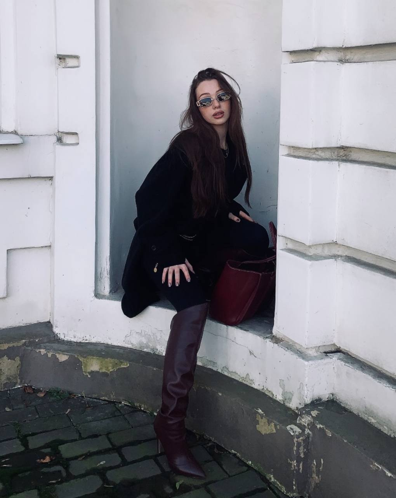

# Varvara Pehtereva

**web developer / fashion enthusiast / multitasker**

---

## about me

  
**goal:** fulfillment in all life areas — passionate about fashion & style, aiming to connect career with it.  
**strengths:** multitasking, patience, fast learning, self-development.  
**experience:** 2 years in food service (people & cash).

---

## contacts

- **phone:** [+375 29 336‑02‑71](tel:+375293360271)
- **email:** [skittlest@mail.ru](mailto:skittlest@mail.ru)
- **telegram:** [@skittlestrnka](https://t.me/skittlestrnka)
- **instagram:** [@ski.tt.les](https://www.instagram.com/ski.tt.les)

---

## skills

1. **microsoft office** – Word, Excel, Access
2. **databases** – SQL (basics)
3. **programming** – C#, C++ (basics), HTML
4. **soft skills** – fast learner, patient, multitasking

---

## projects

- **personal CV website** – [github repo](https://github.com/skittlesvvv-blip/Web_programmirovanie) (pure HTML)

---

## education

- **Figma & Interior Design** – certified course  
  *Certified course in interior design and Figma*

- **University coursework** – computer science, databases, programming fundamentals  
  *Basics of programming, databases, computer science within the university curriculum*

---

## languages

- **English** – B2 (upper‑intermediate)  
  *Read technical documentation, can communicate in writing*

- **Russian** – native

---

## code example

```csharp
// C# greeting function
static string Greet(string name)
{
    return $"Hello, {name}!";
}
